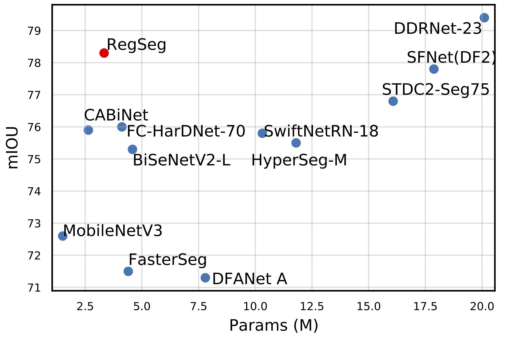
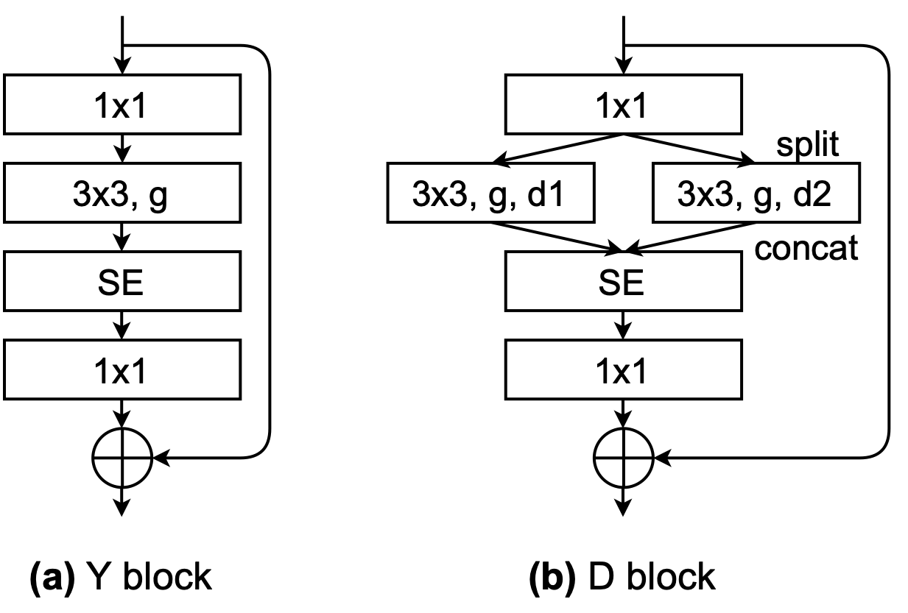
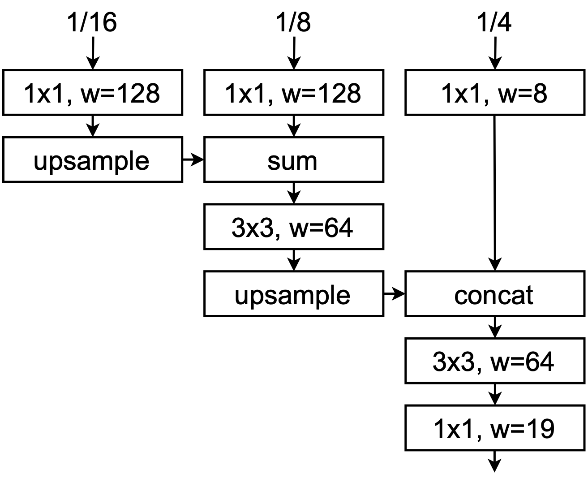

# RegSeg

#### The official implementation of "Rethink Dilated Convolution for Real-time Semantic Segmentation"

Paper: [arxiv](https://arxiv.org/abs/2111.09957)



D block



Decoder




### Setup
Install the dependencies in requirements.txt by using pip and [virtualenv](
https://packaging.python.org/guides/installing-using-pip-and-virtual-environments/).

### Download Cityscapes
go to https://www.cityscapes-dataset.com, create an account, and download
gtFine_trainvaltest.zip and leftImg8bit_trainvaltest.zip.
You can delete the test images to save some space if you don't want to submit to the competition.
Name the directory cityscapes_dataset.
Make sure that you have downloaded the required python packages and run
```
CITYSCAPES_DATASET=cityscapes_dataset csCreateTrainIdLabelImgs
```
There are 19 classes.

### Results from paper
To see the ablation studies results from the paper, go [here](AblationStudies.md).

### Usage
To visualize your model, go to show.py.
To train, validate, benchmark, and save the results of your model, go to train.py.

### Results on Cityscapes server
RegSeg (exp48_decoder26, 30FPS): [78.3](https://www.cityscapes-dataset.com/anonymous-results/?id=f88876222a7be564973065f111746e9838d4da9268734457cb57b2409cdb9818)

Larger RegSeg (exp53_decoder29, 20 FPS): [79.5](https://www.cityscapes-dataset.com/anonymous-results/?id=d15ac10b39ba00bcb344620a423dfe970ece04562a763d8f3f8d0d44376727ae)

### Citation
If you find our work helpful, please consider citing our paper.


```
@article{gao2021rethink,
  title={Rethink Dilated Convolution for Real-time Semantic Segmentation},
  author={Gao, Roland},
  journal={arXiv preprint arXiv:2111.09957},
  year={2021}
}
```
