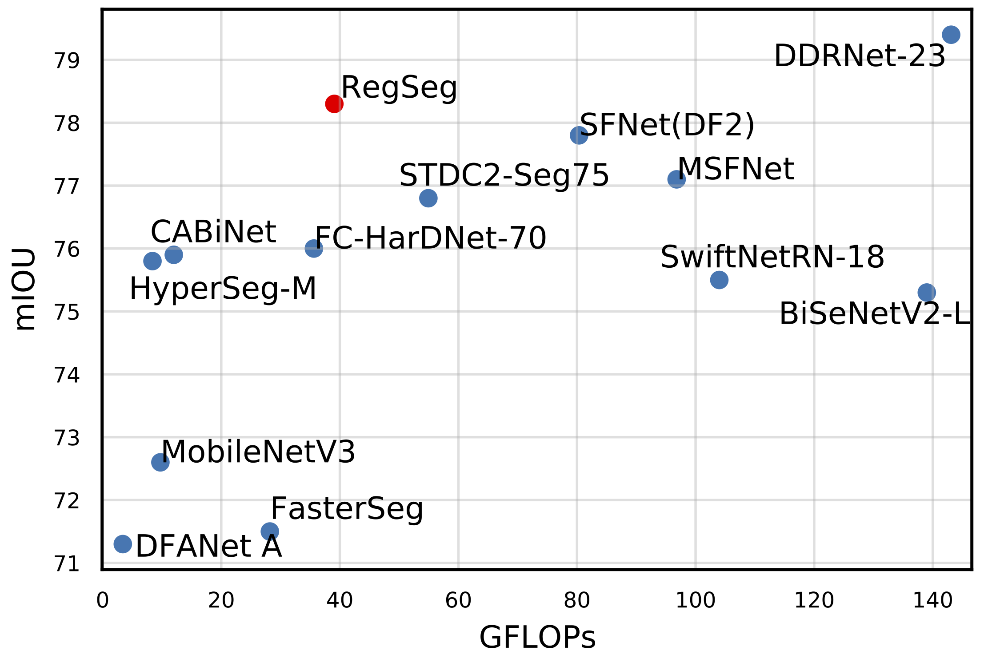

# RegSeg

#### The official implementation of "Rethink Dilated Convolution for Real-time Semantic Segmentation"

Paper: [arxiv](https://arxiv.org/abs/2111.09957)

The code is coming soon.

 

D block

Decoder

